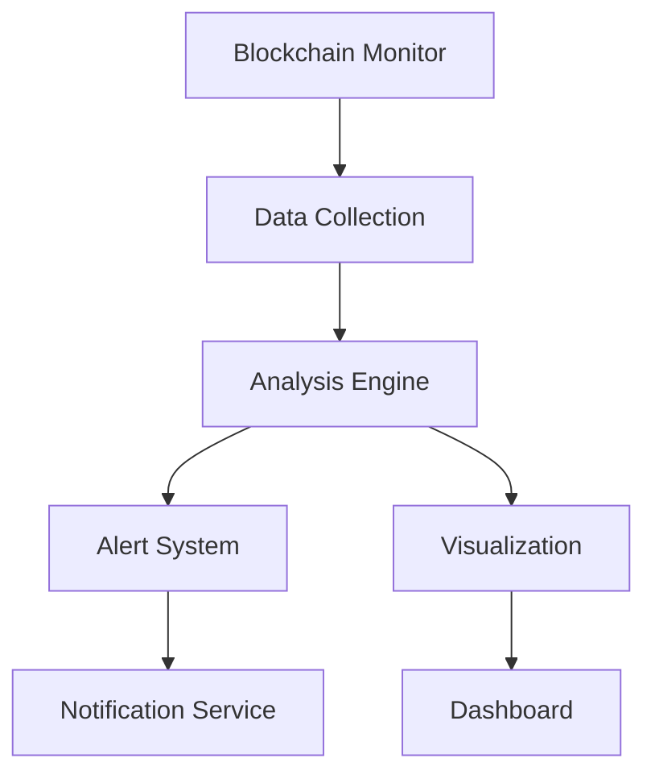

# AgentGPT Blockchain Monitor

[](https://www.npmjs.com/package/@agentgpt/blockchain-monitor)
[](https://opensource.org/licenses/MIT)
[](https://www.typescriptlang.org/)

## Overview

AgentGPT Blockchain Monitor is a powerful TypeScript-based monitoring and analysis tool for blockchain networks. It provides real-time monitoring, analytics, and insights for blockchain transactions and smart contracts.

## Features

- 🔍 Real-time blockchain monitoring
- 📊 Advanced analytics and visualization
- 🔐 Secure transaction tracking
- 📈 Performance metrics
- 🚀 Multi-chain support
- 🔄 Automated alerts and notifications

## Architecture



## Installation

```bash
npm install @agentgpt/blockchain-monitor
```

## Quick Start

```typescript
import { BlockchainMonitor } from '@agentgpt/blockchain-monitor';

const monitor = new BlockchainMonitor({
  network: 'ethereum',
  apiKey: process.env.BLOCKCHAIN_API_KEY
});

monitor.startMonitoring();
```

## Configuration

| Option | Type | Description | Default |
|--------|------|-------------|---------|
| network | string | Blockchain network to monitor | 'ethereum' |
| apiKey | string | API key for blockchain provider | undefined |
| interval | number | Monitoring interval in ms | 5000 |
| alerts | boolean | Enable alert system | true |

## Performance Metrics

| Metric | Description | Target |
|--------|-------------|---------|
| Response Time | API response time | < 100ms |
| Uptime | Service availability | > 99.9% |
| Data Accuracy | Transaction accuracy | > 99.99% |

## Contributing

We welcome contributions! Please see our [Contributing Guide](CONTRIBUTING.md) for details.

## Support

- Documentation: [https://agent-gpt.gitbook.io/agent-gpt](https://agent-gpt.gitbook.io/agent-gpt)
- Email: support@agent-gpt.org
- Telegram: [https://t.me/agentgptorg](https://t.me/agentgptorg)
- Twitter: [https://x.com/agentgptorg](https://x.com/agentgptorg)

## License

MIT License - see the [LICENSE](LICENSE) file for details.

## Roadmap

```mermaid
gantt
    title AgentGPT Blockchain Monitor Roadmap
    dateFormat  YYYY-MM-DD
    section Core
    Basic Monitoring    :done, 30d
    Analytics Engine    :active, 30d
    Alert System        :30d
    section Advanced
    Multi-chain Support :30d
    ML Integration      :30d
    section Enterprise
    API Gateway         :30d
    Enterprise Features :30d
``` 